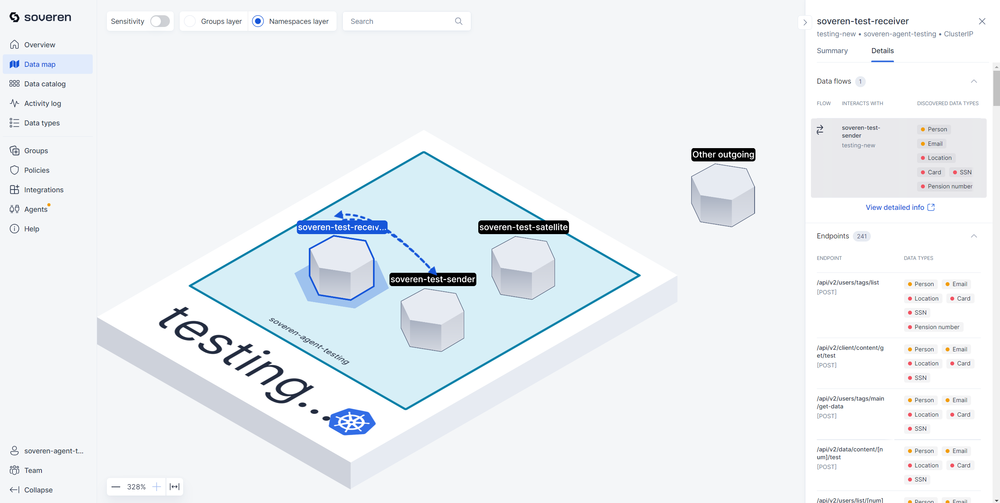
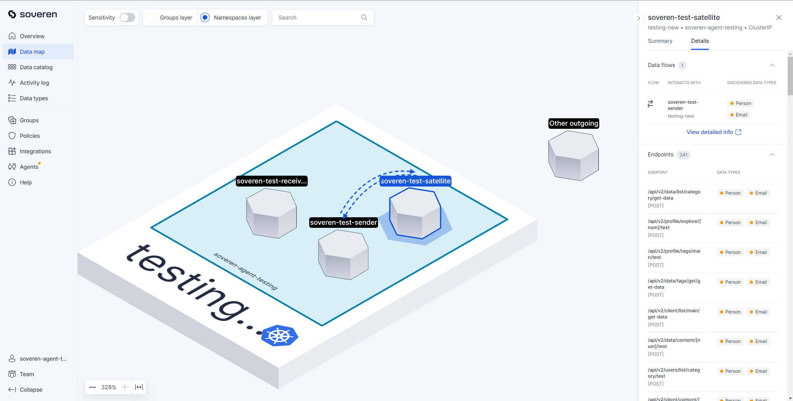
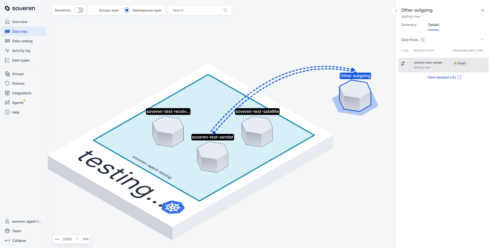
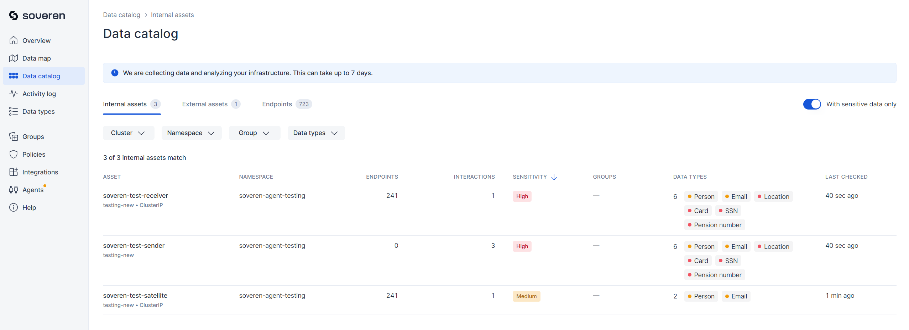
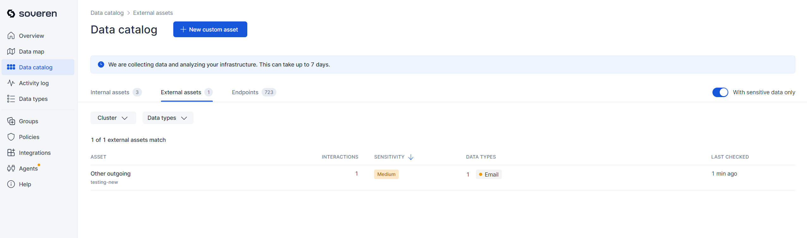
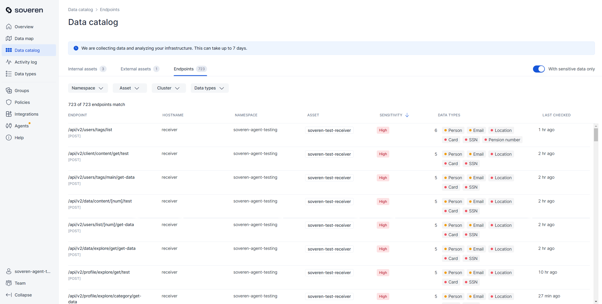
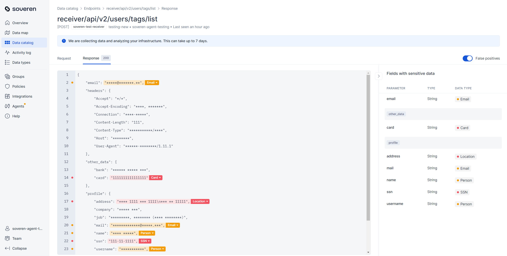

# Soveren sample testing environment 

This chart deploys a Soveren testbed into your existing Kubernetes cluster. This allows you to evaluate Soveren's functionality hands-on, without the need to manage your own traffic.

## Pre-requisites

The primary pre-requisite is having the Soveren Agent deployed in one of your Kubernetes clusters. Refer to our [quick start guide](https://docs.soveren.io/en/stable/getting-started/quick-start/) for instructions on setting up the Agent.

To install the Agent, you will need the following:

- Soveren account. [Get one](https://app.soveren.io/sign-up) if you haven't already.
- A working [Helm](https://helm.sh) installation. Please refer to [documentation](https://helm.sh/docs) to get started.

## Installation

Add the Soveren testing Helm repository:

    helm repo add soveren-test https://soverenio.github.io/helm-charts-testing

If you had already added this repo before, run `helm repo update` to retrieve the latest versions of the packages.  You can then run `helm search repo soveren-test` to see the charts.

Install the `soveren-test` chart:

    helm install demo-load soveren-test/soveren-test

To uninstall the chart:

    helm delete demo-load

## How it works

Three containers, designed for minimal resource usage, are deployed into your Kubernetes cluster:

- `soveren-testing-sender`, henceforth referred to as `Sender`
- `soveren-testing-receiver`, henceforth referred to as `Receiver`
- `soveren-testing-satellite`, henceforth referred to as `Satellite`

Every 15 seconds, the `Sender` dispatches `HTTP` requests to the `Receiver`, `Satellite`, or the `Echo server` (the latter is situated in the Soveren Cloud).

These requests contain the following data:

```json
{
  "email": "john.doe@gmail.com",
  "seed": "!Www123456",
  "rememberMe": true,
  "timestamp": time.time()
}
```

For these requests, a collection of approximately 2000 random URLs is used, along with a single static URL that includes `Email`.

In response to these requests:

- The `Receiver` produces a `JSON` response composed of a random dataset that includes fields of type `Card`, `Email`, `Location`, `Person`, and `SSN`. This ensures that the derived dataset exhibits `high` sensitivity. For a comprehensive explanation, consult the [Sensitive data model](https://docs.soveren.io/en/stable/user-guide/data-model/#the-sensitivity-model).
- The `Satellite` generates a `JSON` response containing the `Email` field and several other random types, resulting in a `medium` sensitivity level.
- The `Echo server` simply echoes back whatever data it receives.

## What you should see in the Soveren app

### Data map

After deploying this chart, you will observe the following in the [data map](https://app.soveren.io/data-map):


Upon closer inspection, there are distinct flows between the `Sender` and each of the following:

`Receiver`:



`Satellite`:



and `Echo server` which is in the `Other outgoing` asset on the map:



### Data catalog

The [data catalog](https://app.soveren.io/data-catalog/) provides detailed views of these assets and flows:

Internal assets, i.e. the ones located inside the cluster:



External assets, i.e. the ones located outside the cluster:



The full list of discovered Endpoints:



### Example response with detections


