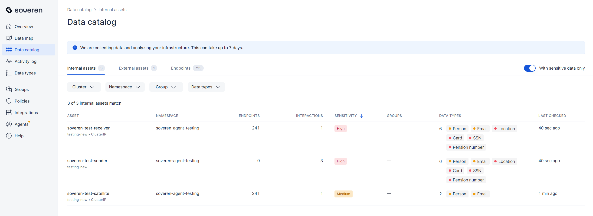
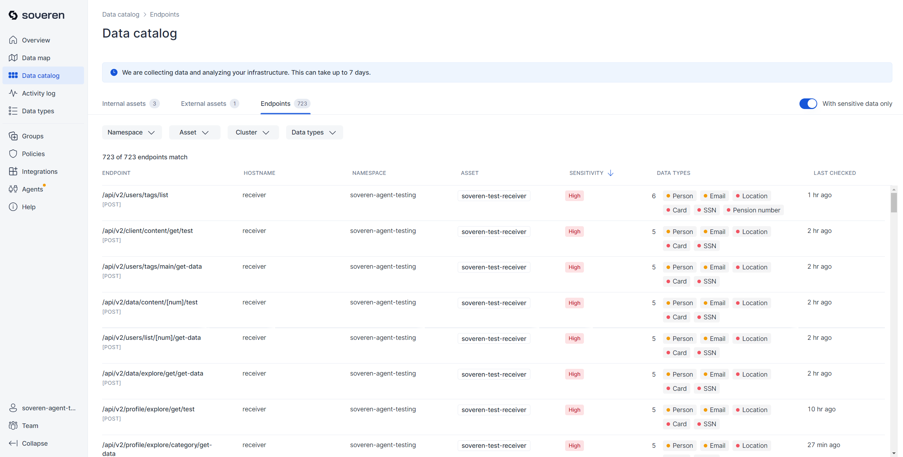

# Soveren Data-in-motion (DIM) Sensor sample testing environment 

This chart deploys a Soveren Data-in-motion (DIM) Sensor testbed into your existing Kubernetes cluster. This allows you to evaluate Soveren's functionality hands-on, without needing to manage your own traffic.

You might also want to test a Soveren Data-at-rest (DAR) Sensor. The simplest way to do that is to [deploy the DAR Sensor](https://docs.soveren.io/en/stable/getting-started/quick-start/#data-at-rest-dar), point it to your [existing S3 bucket](https://docs.soveren.io/en/stable/administration/configuring-sensor/#s3-buckets), and add to that bucket some JSON or CSV files containing data that resembles personal information.

## Prerequisites

The primary prerequisite is having the Soveren DIM Sensor deployed in one of your Kubernetes clusters. Refer to our [quick start guide](https://docs.soveren.io/en/stable/getting-started/quick-start/#data-in-motion-dim) for instructions on setting up the DIM Sensor.

To install the DIM Sensor, you will need the following:

- A Soveren account. If you don't have one already, [sign up](https://app.soveren.io/sign-up).
- A working [Helm](https://helm.sh) installation. Please refer to the [documentation](https://helm.sh/docs) to get started.

## Installation

Add the Soveren testing Helm repository:

```shell
helm repo add soveren-test https://soverenio.github.io/helm-charts-testing
```
Install the `soveren-test` chart:

```shell
helm install demo-load soveren-test/soveren-test
```

If you have already added this repository before, run helm repo update to retrieve the latest versions of the packages. You can then run helm search repo soveren-test to see the charts.

To uninstall the chart:

```shell
helm delete demo-load
```

## How it works

Three containers, designed for minimal resource usage, are deployed into your Kubernetes cluster:

- `soveren-testing-sender`, henceforth referred to as `Sender`
- `soveren-testing-receiver`, henceforth referred to as `Receiver`
- `soveren-testing-satellite`, henceforth referred to as `Satellite`

Every 15 seconds, the `Sender` dispatches `HTTP` requests to the `Receiver`, `Satellite`, or the `Echo server` (the latter is situated in the Soveren Cloud).

These requests contain the following data:

```json
{
  "email": "john.doe@gmail.com",
  "seed": "!Www123456",
  "rememberMe": true,
  "timestamp": time.time()
}
```

For these requests, a collection of approximately 2000 random URLs is used, along with a single static URL that includes `Email`.

In response to these requests:

- The `Receiver` produces a `JSON` response composed of a random dataset that includes fields of type `Card`, `Email`, `Location`, `Person`, and `SSN`. This ensures that the derived dataset exhibits `high` sensitivity. For a comprehensive explanation, consult the [Sensitive data model](https://docs.soveren.io/en/stable/user-guide/data-model/#the-sensitivity-model).
- The `Satellite` generates a `JSON` response containing the `Email` field and several other random types, resulting in a `medium` sensitivity level.
- The `Echo server` simply echoes back whatever data it receives.

## What you should see in the Soveren app

### Data map

After deploying this chart, you will observe the following in the [data map](https://app.soveren.io/data-map):


Upon closer inspection, there are distinct flows between the `Sender` and each of the following:

`Receiver`:


`Satellite`:


and `Echo server` which is in the `Other outgoing` asset on the map:


### Service catalog

The [service catalog](https://app.soveren.io/service-catalog/) provides detailed views of the discovered services and the flows between them.

Services located inside the cluster:



External connections, i.e. services located outside the cluster:


### API endpoints

The full list of API endpoints provided by the discovered services should look as follows:



### Example response with detections

